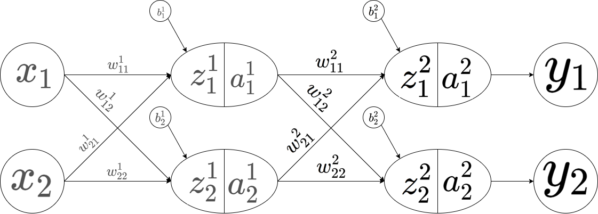

# 神经网络

---
---

## 神经网络图

---
---

## 激活函数

$$
\begin{aligned}
f(x)&=sigmoid(x)=\frac{1}{1+e^{-x}}\\
f'(x)&=\frac{e^{-x}}{(1+e^{-x})^2}\\
&=f(x)\cdot (1-f(x))
\end{aligned}
$$

---
---

## 正向传递

### 输入层

$$
\begin{aligned}
x_1\\
x_2
\end{aligned}
$$

### 隐藏层

$$
\begin{aligned}
z^1_1&=w^1_{11}\cdot x_1+w^1_{21}\cdot x_2+b^1_1\\
\\
z^1_2&=w^1_{12}\cdot x_1+w^1_{22}\cdot x_2+b^1_2\\
\\
\\
a^1_1&=f(z^1_1)\\
\\
a^1_2&=f(z^1_2)
\end{aligned}
$$

### 输出层

$$
\begin{aligned}
z^2_1&=w^2_{11}\cdot a^1_1+w^2_{21}\cdot a^1_2+b^2_1\\
\\
z^2_2&=w^2_{12}\cdot a^1_1+w^2_{22}\cdot a^1_2+b^2_2\\
\\
\\
a^2_1&=f(z^2_1)\\
\\
a^2_2&=f(z^2_1)\\
\\
\\
y_1&=a^2_1\\
\\
y_2&=a^2_2\\
\end{aligned}
$$
---
---

## 反向传递

$$
\begin{aligned}
E_1&=\frac{1}{2}\cdot(\hat{y_1}-y_1)^2\\
E_2&=\frac{1}{2}\cdot(\hat{y_2}-y_2)^2\\
\\
E&=E_1+E_2\\
&=\frac{1}{2}\cdot(\hat y_1-y_1)^2+\frac{1}{2}\cdot (\hat y_2-y_2)^2\\
&=\frac{1}{2}\cdot(\hat y_1-a^2_1)^2+\frac{1}{2}\cdot (\hat y_2-a^2_2)^2\\
\end{aligned}
$$

- ### 第一层

$$
\begin{aligned}
\frac{\partial E}{\partial a^2_1}&=-2\cdot\frac{1}{2}(\hat y_1-a^2_1)^{2-1}+0\\
&=a^2_1-\hat y_1\\
\\
\frac{\partial E}{\partial a^2_2}&=-2\cdot\frac{1}{2}(\hat y_2-a^2_2)^{2-1}+0\\
&=a^2_2-\hat y_2
\end{aligned}
$$

- ### 第二层

$$
\begin{aligned}
\frac{\partial a^2_1}{\partial z^2_1}&=a^2_1\cdot(1-a^2_1)\\
\\
\frac{\partial a^2_2}{\partial z^2_2}&=a^2_2\cdot(1-a^2_2)\\
\\
\frac{\partial E}{\partial z^2_1}&=\frac{\partial E}{\partial a^2_1}\cdot\frac{\partial a^2_1}{\partial z^2_1}\\
&=a^2_1\cdot(a^2_1-\hat y_1)\cdot(1-a^2_1)\\
\\
\frac{\partial E}{\partial z^2_2}&=\frac{\partial E}{\partial a^2_2}\cdot\frac{\partial a^2_2}{\partial z^2_2}\\
&=a^2_2\cdot(a^2_2-\hat y_2)\cdot(1-a^2_2)\\
\end{aligned}
$$

- ### 第三层

$$
\begin{aligned}
\frac{\partial z^2_1}{\partial w^2_{11}}&=a^1_1\\
\\
\frac{\partial z^2_2}{\partial w^2_{12}}&=a^1_1\\
\\
\frac{\partial z^2_1}{\partial w^2_{21}}&=a^1_2\\
\\
\frac{\partial z^2_2}{\partial w^2_{22}}&=a^1_2\\
\\
\\
\\
\frac{\partial E}{w^2_{11}}&=\frac{\partial E}{\partial z^2_1}\cdot\frac{\partial z^2_1}{\partial w^2_{11}}\\
&=a^1_1\cdot a^2_1\cdot(a^2_1-\hat y_1)\cdot(1-a^2_1)\\
\\
\frac{\partial E}{w^2_{12}}&=\frac{\partial E}{\partial z^2_2}\cdot\frac{\partial z^2_2}{\partial w^2_{12}}\\
&=a^1_1\cdot a^2_2\cdot(a^2_2-\hat y_2)\cdot(1-a^2_2)\\
\\
\frac{\partial E}{w^2_{21}}&=\frac{\partial E}{\partial z^2_1}\cdot\frac{\partial z^2_1}{\partial w^2_{21}}\\
&=a^1_2\cdot a^2_1\cdot(a^2_1-\hat y_1)\cdot(1-a^2_1)\\
\\
\frac{\partial E}{w^2_{22}}&=\frac{\partial E}{\partial z^2_2}\cdot\frac{\partial z^2_2}{\partial w^2_{22}}\\
&=a^1_2\cdot a^2_2\cdot(a^2_2-\hat y_2)\cdot(1-a^2_2)\\
\end{aligned}
$$

- ### 第四层

$$
\begin{aligned}
z^2_1&=w^2_{11}\cdot a^1_1+w^2_{21}\cdot a^1_2+b^2_1\\
\\
z^2_2&=w^2_{12}\cdot a^1_1+w^2_{22}\cdot a^1_2+b^2_1\\
\\
\\
\\
\frac{\partial z^2_1}{\partial a^1_1}&=w^2_{11}\\
\\
\frac{\partial z^2_2}{\partial a^1_1}&=w^2_{12}\\
\\
\frac{\partial z^2_1}{\partial a^1_2}&=w^2_{21}\\
\\
\frac{\partial z^2_2}{\partial a^1_2}&=w^2_{22}\\
\\
\\
\\
\frac{\partial a^2_1}{\partial z^2_1}&=a^2_1\cdot(1-a^2_1)\\
\\
\frac{\partial a^2_2}{\partial z^2_2}&=a^2_2\cdot(1-a^2_2)\\
\\
\\
\\
\frac{\partial E}{\partial a^1_1}&=\frac{\partial E_1}{\partial a^1_1}+\frac{\partial E_2}{\partial a^1_1}\\
&=\frac{\partial E_1}{\partial z^2_1}\cdot\frac{\partial z^2_1}{\partial a^1_1}+\frac{\partial E_2}{\partial z^2_2}\cdot\frac{\partial z^2_2}{\partial a^1_1}\\
&=\frac{\partial E_1}{\partial a^2_1}\cdot\frac{\partial a^2_1}{\partial z^2_1}\cdot\frac{\partial z^2_1}{\partial a^1_1}+\frac{\partial E_2}{\partial a^2_2}\cdot\frac{\partial a^2_2}{\partial z^2_2}\cdot\frac{\partial z^2_2}{\partial a^1_1}\\
&=w^2_{11}\cdot a^2_1\cdot(a^2_1-\hat{y_1})\cdot(1-a^2_1)+w^2_{12}\cdot a^2_2\cdot(a^2_2-\hat{y_2})\cdot(1-a^2_2)\\
\\
\frac{\partial E}{\partial a^1_2}&=\frac{\partial E_1}{\partial a^1_2}+\frac{\partial E_2}{\partial a^1_2}\\
&=\frac{\partial E_1}{\partial z^2_1}\cdot\frac{\partial z^2_1}{\partial a^1_2}+\frac{\partial E_2}{\partial z^2_2}\cdot\frac{\partial z^2_2}{\partial a^1_2}\\
&=\frac{\partial E_1}{\partial a^2_1}\cdot\frac{\partial a^2_1}{\partial z^2_1}\cdot\frac{\partial z^2_1}{\partial a^1_2}+\frac{\partial E_2}{\partial a^2_2}\cdot\frac{\partial a^2_2}{\partial z^2_2}\cdot\frac{\partial z^2_2}{\partial a^1_2}\\
&=w^2_{21}\cdot a^2_1\cdot(a^2_1-\hat{y_1})\cdot(1-a^2_1)+w^2_{22}\cdot a^2_2\cdot(a^2_2-\hat{y_2})\cdot(1-a^2_2)
\end{aligned}
$$

- ### 第五层

$$
\begin{aligned}
\frac{\partial a^1_1}{\partial z^1_1}&=a^1_1\cdot(1-a^1_1)\\
\\
\frac{\partial a^1_2}{\partial z^1_2}&=a^1_2\cdot(1-a^1_2)\\
\\
\\
\\
\frac{\partial E}{\partial z^1_1}&=\frac{\partial E}{\partial a^1_1}\cdot\frac{\partial a^1_1}{\partial z^1_1}\\
&=a^1_1\cdot(1-a^1_1)\cdot[w^2_{11}\cdot a^2_1\cdot(a^2_1-\hat{y_1})\cdot(1-a^2_1)+w^2_{12}\cdot a^2_2\cdot(a^2_2-\hat{y_2})\cdot(1-a^2_2)]\\
\\
\frac{\partial E}{\partial z^1_2}&=\frac{\partial E}{\partial a^1_2}\cdot\frac{\partial a^1_2}{\partial z^1_2}\\
&=a^1_2\cdot(1-a^1_2)\cdot[w^2_{21}\cdot a^2_1\cdot(a^2_1-\hat{y_1})\cdot(1-a^2_1)+w^2_{22}\cdot a^2_2\cdot(a^2_2-\hat{y_2})\cdot(1-a^2_2)]
\end{aligned}
$$

- ### 第六层

$$
\begin{aligned}
\frac{\partial z^1_1}{\partial w^1_{11}}&=x_1\\
\\
\frac{\partial z^1_2}{\partial w^1_{12}}&=x_1\\
\\
\frac{\partial z^1_1}{\partial w^1_{21}}&=x_2\\
\\
\frac{\partial z^1_2}{\partial w^1_{22}}&=x_2\\
\\
\\
\\
\frac{\partial E}{\partial w^1_{11}}&=\frac{\partial E}{\partial z^1_1}\cdot\frac{\partial z^1_1}{\partial w^1_{11}}\\
&=x_1\cdot a^1_1\cdot(1-a^1_1)\cdot[w^2_{11}\cdot a^2_1\cdot(a^2_1-\hat{y_1})\cdot(1-a^2_1)+w^2_{12}\cdot a^2_2\cdot(a^2_2-\hat{y_2})\cdot(1-a^2_2)]\\
\\
\frac{\partial E}{\partial w^1_{12}}&=\frac{\partial E}{\partial z^1_2}\cdot\frac{\partial z^1_2}{\partial w^1_{12}}\\
&=x_1\cdot a^1_2\cdot(1-a^1_2)\cdot[w^2_{21}\cdot a^2_1\cdot(a^2_1-\hat{y_1})\cdot(1-a^2_1)+w^2_{22}\cdot a^2_2\cdot(a^2_2-\hat{y_2})\cdot(1-a^2_2)]\\
\\
\frac{\partial E}{\partial w^1_{21}}&=\frac{\partial E}{\partial z^1_1}\cdot\frac{\partial z^1_1}{\partial w^1_{21}}\\
&=x_2\cdot a^1_1\cdot(1-a^1_1)\cdot[w^2_{11}\cdot a^2_1\cdot(a^2_1-\hat{y_1})\cdot(1-a^2_1)+w^2_{12}\cdot a^2_2\cdot(a^2_2-\hat{y_2})\cdot(1-a^2_2)]\\
\\
\frac{\partial E}{\partial w^1_{22}}&=\frac{\partial E}{\partial z^1_2}\cdot\frac{\partial z^1_2}{\partial w^1_{22}}\\
&=x_2\cdot a^1_2\cdot(1-a^1_2)\cdot[w^2_{21}\cdot a^2_1\cdot(a^2_1-\hat{y_1})\cdot(1-a^2_1)+w^2_{22}\cdot a^2_2\cdot(a^2_2-\hat{y_2})\cdot(1-a^2_2)]\\
\end{aligned}
$$
